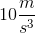
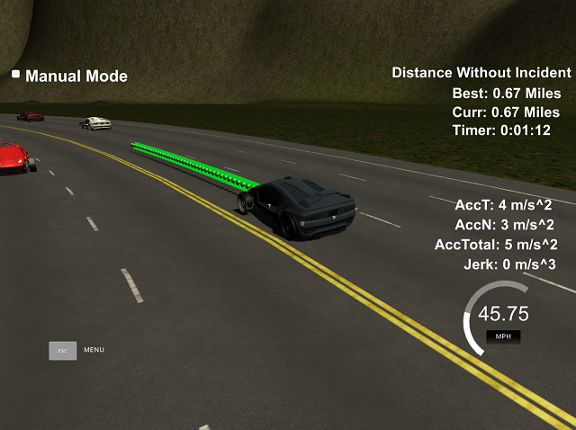
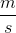
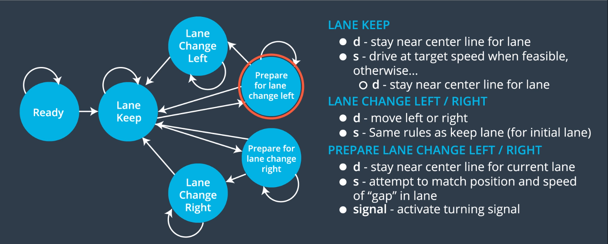

# **Path Planning** 

**Vehicle Path Planning Project Goals**

* Generate paths to safely navigate a virtual vehicle for at least 4.32 miles on a virtual highway through traffic while:
  * Maintaining a vehicle speed between 40 MPH and 50 MPH.
  * Not exceeding acceleration of .
  * Not exceeding jerk of .
  * Not colliding with other vehicles.
  * Spending no more than 3 seconds outside lane lines while changing lanes.
  * Changing lanes smoothly when it make sense to due so.
* Summarize the code for generating paths.

---
## Overview

The C++ project solution is a plans the behavior and trajectory of a vehicle on a simulated highway within the [Udacity simulator](https://github.com/udacity/self-driving-car-sim/releases/tag/T3_v1.2).    The starting code provided by Udacity can be found [here](https://github.com/udacity/CarND-Path-Planning-Project).    

A view of the path planner driving the virtual vehicle is below.  


### Path Planner

The goal of a path planner is to determine the safest, most comfortable, and efficient path from the vehicle's current location to it's target location.   

### Simulator

A screenshot of the simulated vehicle controlled by the path planner is below.   The green line is the selected trajectory calculated by the path planner controller ([main.cpp](src/main.cpp)).



The [Udacity simulator](https://github.com/udacity/self-driving-car-sim/releases/tag/T3_v1.2) provides the following data to the controller via WebSocket:

##### Main Car's Localization Data (No Noise)

| Parameter | Data Type | Description                                                  |
| --------- | --------- | ------------------------------------------------------------ |
| `x`       | *double*  | The car's    position in map coordinates.  |
| `y`       | *double*  | The car's   position in map coordinates.   |
| `s`       | *double*  | The car's    position in Frenet coordinates. |
| `d`       | *double*  | The car's    position in Frenet coordinates. |
| `yaw`     | *float*   | The car's yaw angle in the map.                              |
| `speed`   | *float*   | The car's speed in MPH.                                      |

##### Previous path data given to the Planner

| Parameter         | Data Type             | Description                                                  |
| ----------------- | --------------------- | ------------------------------------------------------------ |
| `previous_path_x` | *Array&lt;double&gt;* | The previous list of  points previously given to the simulator. |
| `previous_path_y` | *Array&lt;double&gt;* | The previous list of  points previously given to the simulator. |
| `end_path_s`      | *double*              | The previous list's last point's Frenet  value. |
| `end_path_d`      | *double*              | The previous list's last point's Frenet  value. |

##### Sensor Fusion Data, a list of all other car's attributes on the same side of the road. (No Noise)


| Parameter       | Data Type                            | Description                                                  |
| --------------- | ------------------------------------ | ------------------------------------------------------------ |
| `sensor_fusion` | *vector&lt;vector&lt;double&gt;&gt;* | A 2d vector of cars and then that car's [car's unique ID, car's  position in map coordinates, car's  position in map coordinates, car'svelocity in , car's y velocity in , car's  position in frenet coordinates, car's  position in Frenet coordinates. |


The path planning solution receives the elements described above from the simulator ([main.cpp](src/main.cpp) lines 246-261) and then calculates and returns the following values.

| Parameter | Data Type             | Description                                                  |
| --------- | --------------------- | ------------------------------------------------------------ |
| `next_x`  | *Array&lt;double&gt;* | The car's next set of  values in map coordinates according to the path planner's calculated trajectory.  These values are displayed within the simulator as a **green** line. |
| `next_y`  | *Array&lt;double&gt;* | The car's next set of  values in map coordinates according to the path planner's calculated trajectory. These values are displayed within the simulator as a **green** line. |


### Path Planner Solution

#### Behavior Planner

The image below shows the finite states from Behavior Planning class in the Udacity class.   The behavior planner's job is to create the list of next possible states and then choose the state with the lowest cost.  The finite state machine and cost functions are implemented in the  `successor_states` function ([vehicle.cpp](src/vehicle.cpp) line 71) and the `calculate_cost` function ([cost.cpp](src/cost.cpp) line 74).




#### Trajectory Planner

The trajectory generator function `generate_next_trajectory`  ([trajectory_generator.cpp](src/trajectory_generator.cpp) line 8) generates a smooth transition trajectory which does not cause the vehicle to exceed the acceleration, jerk, and velocity limits.  It does this by first calculating a few points where we want the car to move based on the lane and velocity returned by the behavior planner and then uses the spline library ([spline.h](src/spline.h)) to calculate a smooth set of waypoints.

## Dependencies

- cmake >= 3.5

  - All OSes: [click here for installation instructions](https://cmake.org/install/)

- make >= 4.1(mac, linux), 3.81(Windows)

  - Linux: make is installed by default on most Linux distros
  - Mac: [install Xcode command line tools to get make](https://developer.apple.com/xcode/features/)
  - Windows: [Click here for installation instructions](http://gnuwin32.sourceforge.net/packages/make.htm)

- gcc/g++ >= 5.4

  - Linux: gcc / g++ is installed by default on most Linux distros
  - Mac: same deal as make - [install Xcode command line tools]((https://developer.apple.com/xcode/features/)
  - Windows: recommend using [MinGW](http://www.mingw.org/)

- [uWebSockets](https://github.com/uWebSockets/uWebSockets)

  - Run either `install-mac.sh` or `install-ubuntu.sh`.

  - If you install from source, checkout to commit `e94b6e1`, i.e.

    ```
    git clone https://github.com/uWebSockets/uWebSockets
    cd uWebSockets
    git checkout e94b6e1
    ```

- **Ipopt and CppAD:** Please refer to [this document](https://github.com/udacity/CarND-MPC-Project/blob/master/install_Ipopt_CppAD.md) for installation instructions.

- [Eigen](http://eigen.tuxfamily.org/index.php?title=Main_Page). This is already part of the repo so you shouldn't have to worry about it.

- Simulator. You can download these from [here](https://github.com/udacity/self-driving-car-sim/releases/tag/T3_v1.2).


## Basic Build Instructions

1. Clone this repo.
2. Make a build directory: `mkdir build && cd build`
3. Compile: `cmake .. && make`
4. Run it: `./path-planning`.

------

